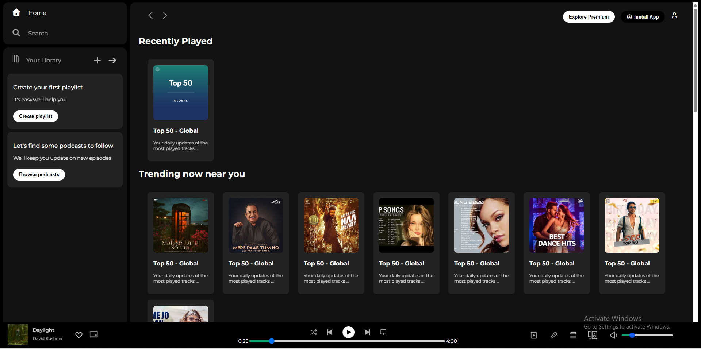
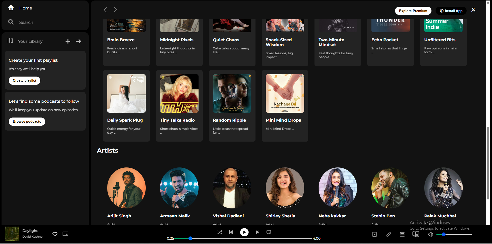

# 🎵 Spotify UI Clone

A responsive Spotify-inspired user interface built using only **HTML** and **CSS**. This project recreates the layout and design of Spotify's web player as a frontend practice project.

> **Note:** This is a static UI project. It does not include music playback, authentication, or backend functionality.

---

## ✨ Features

- 🎨 Spotify-inspired interface
- 📱 Responsive layout
- 🎵 Music player design
- 📂 Sidebar navigation
- 📀 Album and playlist cards
- 🔍 Search bar UI
- 🎧 Bottom music player
- 💻 Clean and modern design

---

## 🛠 Technologies Used

- HTML5
- CSS3

---

## 📁 Project Structure

```
spotify/
├── index.html
├── style.css
├── assets/
└── README.md
```

---

## 🚀 Getting Started

### Clone the repository

```bash
git clone https://github.com/prahans/spotify.git
```

### Open the project

Simply open `index.html` in your browser.

---

## 📚 What I Learned

This project helped me practice:

- Semantic HTML
- CSS Flexbox
- CSS Grid
- Responsive Design
- Layout Structuring
- UI Cloning
- Modern CSS Styling

---

## 📸 Screenshot

### Home Page




---

## ⭐ Support

If you found this project helpful, consider giving it a ⭐ on GitHub.

---

## 📄 License

This project is for educational purposes only.

The design is inspired by Spotify and is **not affiliated with or endorsed by Spotify**.
